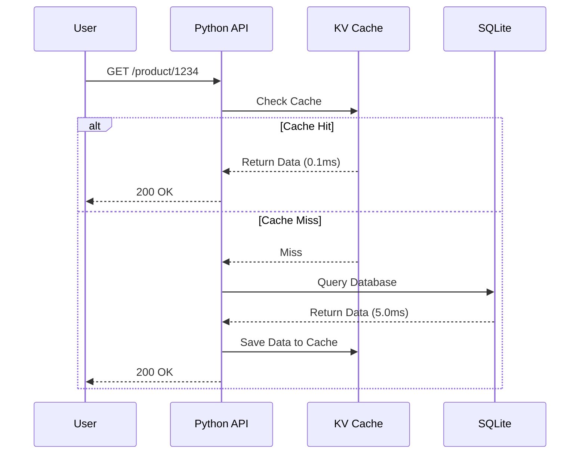

# KV Cache


KV Cache is a high-performance, concurrent, sharded in-memory key-value cache server written entirely from scratch in C++. It features a custom TCP protocol and acts as an ultra-fast data layer sitting in front of a slower database to absorb read-heavy traffic (Cache-Aside pattern).

This project simulates real-world caching architectures and includes a practical Python Flask web API to demonstrate database offloading and distributed atomic rate-limiting.

---

## Performance Benchmark

The server was stress-tested using a custom concurrent C++ benchmarking tool (`kv_bench`). When bombarded by **50 parallel threads** reading and writing simultaneously on a standard Apple Silicon machine, it achieved:

| Metric | Result |
|--------|--------|
| **Total Operations** | `2,162,432` ops |
| **Throughput** | **`216,127` ops/sec** |
| **p50 Latency (Median)** | `0.22 ms` |
| **p95 Latency** | `0.25 ms` |
| **p99 Latency** | `0.29 ms` |

Because of its strict Sharded `std::shared_mutex` architecture, the server handles extreme concurrency without a single data race, segfault, or lock contention bottleneck.

---

## Architecture

### 1. Sharded Memory Engine
To prevent thread contention, the cache is partitioned into **16 independent Shards**. Instead of locking the entire cache when a thread reads or writes, the server hashes the key and only locks that specific shard. This means 16 different threads can access the cache at the exact same time without waiting in line for each other.

### 2. Cache-Aside Pattern (Database Offloading)
The included Python Flask API demonstrates how the cache intercepts requests to save the SQLite database from heavy loads.



---

## Key Features

* **Sharded Locking:** Uses `std::shared_mutex` for concurrent multi-reader / single-writer access per shard.
* **O(1) LRU Eviction:** Every shard maintains a doubly-linked list. When a shard hits its max capacity, the Least Recently Used item is instantly evicted.
* **Background TTL Sweeper:** A dedicated daemon thread periodically scans the cache and deletes expired keys in the background to prevent memory leaks.
* **Atomic INCR:** Supports thread-safe, lock-protected integer increments. Used by the Python API to create a highly robust Distributed Rate Limiter.
* **TCP Socket Server:** Implements a custom line-based network protocol over standard POSIX sockets.
* **Connection Pooling:** The Python client implements connection pooling to reuse TCP sockets and prevent port exhaustion under heavy load.

---

## Build & Run Instructions

### 1. Compile the C++ Server
You can build the project using raw `clang++` (no CMake required):

```bash
# Build the Cache Server
clang++ -std=c++17 -O3 -Icache/include cache/src/*.cpp -o build/kv_server

# Build the Benchmark Tool
clang++ -std=c++17 -O3 -Icache/include cache/src/logger.cpp cache/src/lru_list.cpp cache/src/protocol.cpp cache/src/shard.cpp cache/src/stats.cpp cache/src/tcp_server.cpp cache/src/ttl_sweeper.cpp cache/src/kv_cache.cpp bench/kv_bench.cpp -o build/kv_bench
```

### 2. Start the Server
```bash
./build/kv_server --port=6380 --shards=16 --max-entries-per-shard=1000
```

### 3. Run the Concurrency Benchmark
In a separate terminal, hammer the server with 50 threads:
```bash
./build/kv_bench --shards=16 --threads=50 --distribution=zipfian
```

---

## Python Web API Demo

The `demo_api/` folder contains a real-world e-commerce API simulation.

**1. Setup & Seed the Database**
```bash
cd demo_api
pip install flask requests
python seed_db.py  # Generates 10,000 dummy products
```

**2. Start the API**
```bash
python product_api.py
# Runs on http://127.0.0.1:5001
```

**3. Test Cache Speedup**
```bash
python demo_cold_vs_warm.py
```
*Output:*
```text
Testing with Product ID 6793...
Making first request (cold)...
First request (cold):  9.26ms   [DB hit]
Making second request (warm)...
Second request (warm):  0.96ms   [cache hit]
Speedup: ~9x
```

### Direct Terminal Access
Because the server speaks standard TCP, you can connect to it manually:
```bash
nc 127.0.0.1 6380
> SET name Aprajita EX 60
+OK
> GET name
$Aprajita
> STATS
+hits=1 misses=0 evictions=0 expirations=0
```
